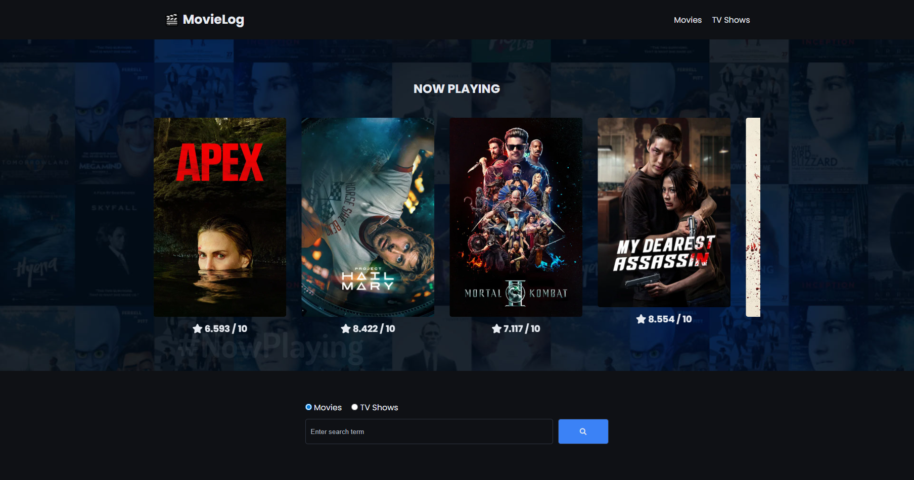
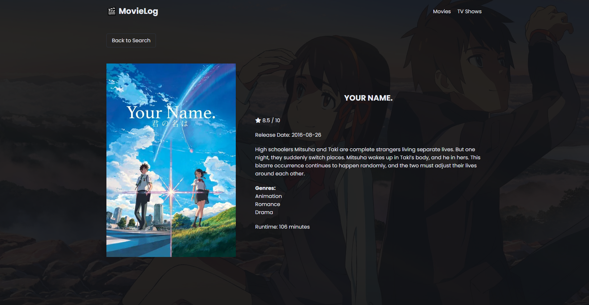

# MovieLog - Movie and TV Show Catalog App

A movie and TV show catalog web app built with vanilla JavaScript using the TMDB API.

The app lets users browse popular movies and TV shows, search for specific titles, and view detailed information about each result.

[Check it out!](https://rodrigo-gonzalez-tech.github.io/movielog-app/)

## Preview

## Features

- Browse popular movies and TV shows
- Search for titles dynamically
- Dedicated details page for each movie/show
- "Now Playing" carousel on the homepage using Swiper
- Dynamic background/backdrop images
- Responsive UI
- Multiple page navigation with vanilla JavaScript

## Built With

- HTML
- CSS
- Vanilla JavaScript
- TMDB API
- Swiper.js

## What I Practiced

The main goal of this project was to combine everything I've been practicing into a larger and more complete application.

Some of the concepts I focused on were:

- Working with external APIs
- Fetching and handling asynchronous data
- Dynamically updating the DOM
- Managing data across multiple pages
- Building reusable UI components
- Handling search functionality
- Organizing a larger vanilla JavaScript project
